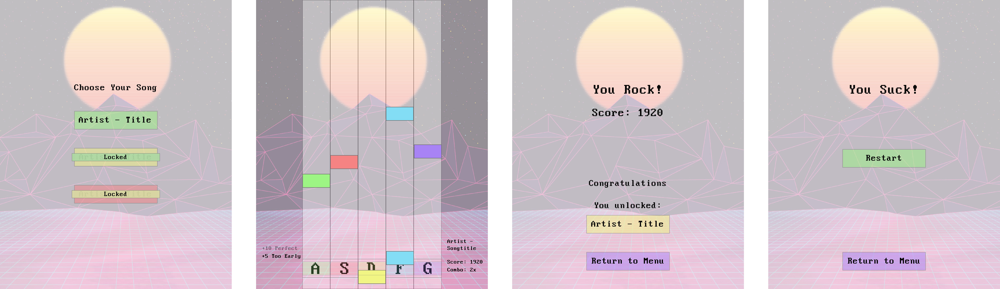
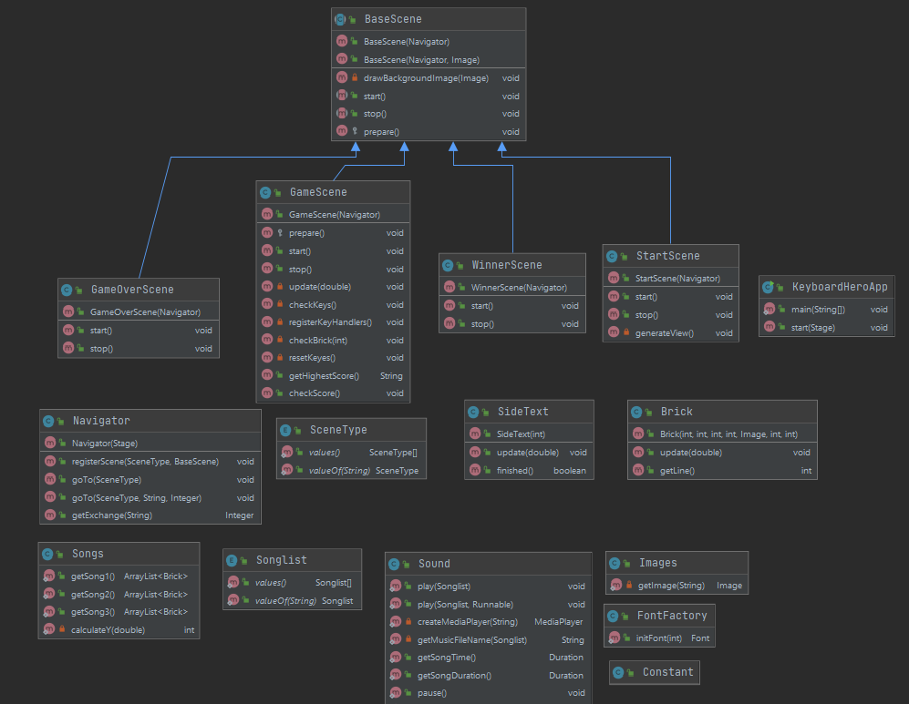

# Keyboard Hero

### Abstract
Ein Java-Spiel im Stil von Guitar Hero. 
Im Takt von Musik müssen die richtigen Tasten gedrückt werden. Es gibt fünf Tasten die eine Bahn zugeordnet sind. 
In dieser vertikalen Bahn fahren Rechtecke herunter die Noten repräsentieren. Wird die Taste am Richtigen Zeitpunkt 
gedrückt sobald die Note das Ende der Bahn erreicht hat, erhält der Spieler Punkte. Ist der Spieler zu früh oder spät,
gibt es weniger Punkte. Das Spiel ist gewonnen, wenn das Lied fertig ist und eine spezifische Anzahl Noten getroffen wurde.
Der Spieler verliert, wenn eine spezifische Anzahl Noten in Folge nicht getroffen wurde.

### Mockups
#### Menu/Game Screen/Winner Screen/Loser Screen: 

### Klassendiagramm   

### Fazit
Das Projekt machte grosse Freude und ich bin sehr stolz auf das Resultat.
Ich war froh konnte ich ausnahmsweise alleine arbeiten, auch wenn ich die Hilfe
von Andreas und Marco sehr gerne in Anspruch nahm. In einem Team zu arbeiten sehe
ich aber trotzdem als die bessere Variante. Alleine konnte ich all meine User-Stories
umsetzten, wäre aber sicher weitergekommen in einem Team.   Die Herausforderung mit der 
Synchronisation des Visuellen mit dem Akustischen war sicher die grösste Schwierigkeit.
Die Hilfe durch die Coaches und das gemeinsame Erarbeiten der Lösung war sehr spannend.
Während der Realisierung merke ich immer wieder das der Anspruch auf eine "perfekte" Lösung
nicht realistisch war und ich mich gut und gerne mit einer Lösung zufrieden geben kann, die
die Anforderung entsprechen. Die Verbindung mit der Musik in diesem Projekt machte mir
am meisten Spass und war gleichzeitig langwierig und manchmal ermüdend. Ich konnte aber
dank meiner Einzelarbeit, kurz auf eine kleineres Thema eingehen um dann wieder mit einem frischen Kopf in das
Abbilden der Noten in den Levels einzusteigen. In diesem Projekt festigte ich meine Java
Kenntnise und konnte Sicherheit gewinnen. Nun hoffe ich das ich meine Skills im Mobile App ÜK
abrufen kann.
